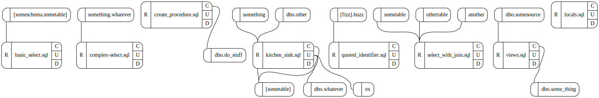

# About

It's a t-sql parser library, ~~mostly~~ *entirely* mssql flavored, but the scanner is fairly agnostic
and I plan to extend it later for other vendors.

The long-term vision for this project is to integrate with my other datbase management project
and provide a sql linter / analyzer / code fix provider. Maybe as a SQL Ops studio extension or something.

# Status
- [x] scan huge list of sql tokens
- [x] math ops / comparisons / case expressions / function calls
- [x] select / from / where / order by / group by / having
- [ ] create
  - [x] table / view / proc / statistics
  - [ ] with (options...)
  - [ ] contraints inside create-table
  - [ ] functions
  - [ ] about a billion more types
- [X] update
- [x] delete
- [ ] drop
  - [x] table
  - [x] procedure
  - [x] view
  - [x] function
  - [x] database
  - [x] schema
  - [x] index
  - [ ] like 100 more dropppable objects
- [ ] alter
  - [x] table (20%)
  - [ ] procedure
  - [ ] view
  - [ ] ... more
- [x] in / exists / like / not
- [ ] any / all / some (50%)
- [x] Common Table Expressions
- [ ] fulltext search
- [ ] cursors
- [ ] transactions
- [ ] Warehouse Features
  - [x] Create Table As Select (buggy)
  - [ ] Create remote table as select
- [x] TOOLS
  - [x] AST pretty-printer
  - [x] example linter / analyzer with some decent starter rules
  - [x] dependency graph generator

# Shower Thoughts

## Format with symbolic names

Pretty-print code based on the underlying table schema.

```sql
SELECT * FROM SOME.TABLENAMEHERE
-- to
select * from some.TableNameHere
```

## Vizualize the relationships between scripts with graphviz

```
node .\dist\src\index.js graph .\test\mssql\kitchen_sink.sql | dot -Tsvg | out-file graph.svg
```



## Module: Data Governance

- [Change Governance] Detect logical conflicts between multiple changes.
- Trace risk impact of a change against an entire system
- Reverse a field to find all the upstream calculations
  - include filters and possibly data volume information?
    - 5M -> {filter} -> 2m -> {filter} -> 100k 
- Mass-Refactoring: flow a data type change or column rename through an entire
  codebase and generate the required
- Experiment: test a change (at a small scale) to see how a code change will affect the
  end result.

## Z3 Server

Read about SAT-solvers on reddit recently.

Currently, I have a naive check for obviously UNSAT conditionals, such as a != a, however
I can think of some less obvious cases that could be automatically proven UNSAT,
such as len(anything) < 0, (a + b) != (b + a) and things like that.

So, my hair-brained idea is to write some sort of crazy out-of-process z3 server with a grpc binding.

Encode all boolean expressions as theorems and attempt to prove SAT, or declare the code
unreachable.

